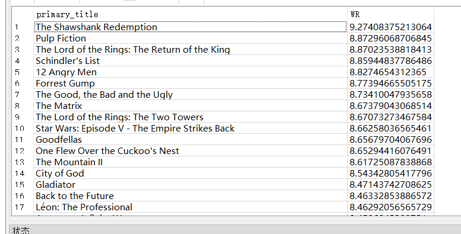

# HOMEWORK #1 - SQL

# OVERVIEW（总览）

The first homework is to construct a set of SQL queries（查询） for analysing a dataset that will be provided（提供） to you. For this（为此）, you will look into（浏览） [IMDB data](https://www.imdb.com/interfaces/). This homework is an opportunity（机会） to: (1) learn basic and certain（某些） advanced SQL features（特性、功能）, and (2) get familiar（熟悉） with using a full-featured（全功能） DBMS, [SQLite](https://www.sqlite.org/), that can be useful for you in the future.

This is a single-person project that will be completed individually (i.e., no groups).

- **Release Date:** Sep 01, 2019
- **Due Date:** Sep 11, 2019 @ 11:59pm

# SPECIFICATION（规范）

The homework contains 10 questions in total and is graded out of 100 points. For each question, you will need to construct a SQL query（查询） that fetches（获取） the desired（渴望得到的） data from the SQLite DBMS. It will likely take you approximately 6-8 hours to complete the questions.

## PLACEHOLDER FOLDER（占位符文件夹）

Create the placeholder submission folder with the empty SQL files that you will use for each question:

```
$ mkdir placeholder
$ cd placeholder
$ touch q1_sample.sql \
        q2_uncommon_type.sql \
        q3_tv_vs_movie.sql \
        q4_old_is_not_gold.sql \
        q5_percentage.sql \
        q6_dubbed_smash.sql \
        q7_imdb_250.sql \
        q8_number_of_actors.sql \
        q9_movie_names.sql \
        q10_genre_counts.sql
```

After filling in the queries, you can compress the folder by running the following command:

（填写查询后，您可以通过运行以下命令压缩文件夹：）

```
$ zip -j submission.zip placeholder/*.sql
```

The `-j` flag lets you compress all the SQL queries in the zip file without path information. The grading scripts will **not** work correctly unless you do this.

# INSTRUCTIONS（使用说明）

## SETTING UP SQLITE

You will first need to install SQLite on your development machine.

### INSTALL SQLITE3 ON UBUNTU LINUX

Install the `sqlite3` and `libsqlite3-dev` packages by running the following command;

```
$ sudo apt-get install sqlite3 libsqlite3-dev
```

### INSTALL SQLITE3 ON MAC OS X

On Mac OS Leopard or later, you don't have to! It comes pre-installed. You can upgrade it, if you absolutely need to, with [Homebrew](https://15445.courses.cs.cmu.edu/fall2019/homework1/brew.sh).

## LOAD THE DATABASE DUMP（加载实验数据库）

Check if `sqlite3` is properly working by [following this tutorial](https://sqlite.org/cli.html#getting_started).

Download the [database dump file](https://15445.courses.cs.cmu.edu/fall2019/files/imdb-cmudb2019.db.gz):

```
$ wget https://15445.courses.cs.cmu.edu/fall2019/files/imdb-cmudb2019.db.gz
```

Check its MD5 checksum to ensure that you have correctly downloaded the file:

```
$ md5 imdb-cmudb2019.db.gz 
MD5 (imdb-cmudb2019.db.gz) = 6443351d4b55eb3c881622bd60a8dc5b
```

Unzip the database from the provided database dump by running the following commands on your shell. Note that the database file be **900MB** after you decompress it.

```
$ gunzip imdb-cmudb2019.db.gz
$ sqlite3 imdb-cmudb2019.db
```

We have prepared a random sample of the original dataset for this assignment. Although this is not required to complete the assignment, the complete dataset is available by following the steps [here](https://pypi.org/project/imdb-sqlite/).

（我们已经为这个任务准备了原始数据集的随机样本。尽管这不是完成分配所必需的，但是通过以下步骤[此处](https://pypi.org/project/imdb-sqlite/)可以得到完整的数据集。）

Check the contents of the database by running the `.tables` command on the `sqlite3` terminal. You should see **6 tables**, and the output should look like this:

（通过执行指令，检查数据库的内容。在' sqlite3 '终端上输入 `.tables`。您应该看到**6张表**，输出应该如下所示：）

```
$ sqlite3 imdb-cmudb2019.db
SQLite version 3.11.0
Enter ".help" for usage hints.
sqlite> .tables
akas      crew      episodes  people    ratings   titles
```

Create indices using the following commands in SQLite:

（在SQLite中使用以下命令创建索引：）

```
CREATE INDEX ix_people_name ON people (name);
CREATE INDEX ix_titles_type ON titles (type);
CREATE INDEX ix_titles_primary_title ON titles (primary_title);
CREATE INDEX ix_titles_original_title ON titles (original_title);
CREATE INDEX ix_akas_title_id ON akas (title_id);
CREATE INDEX ix_akas_title ON akas (title);
CREATE INDEX ix_crew_title_id ON crew (title_id);
CREATE INDEX ix_crew_person_id ON crew (person_id);
```

## CHECK THE SCHEMA

Get familiar with the schema (structure) of the tables (what attributes do they contain, what are the primary and foreign keys). Run the `.schema $TABLE_NAME` command on the `sqlite3` terminal for each table. The output should look like the example below for each table.

（熟悉表的结构（它们包含什么属性，主键和外键是什么）。运行`.schema $TABLE_NAME`。每个表的输出应该如下面的示例所示。）

### PEOPLE

```
sqlite> .schema people
CREATE TABLE people (
  person_id VARCHAR PRIMARY KEY,
  name VARCHAR,
  born INTEGER,
  died INTEGER
);
CREATE INDEX ix_people_name ON people (name);
```

Contains details for a person. For example, this is a row from the table:

（包含个人的详细信息。例如，这是表中的一行：）

```
nm0000003|Brigitte Bardot|1934|
```

For us, the important fields are `person_id` (e.g., "nm0000003"), `name` (e.g., "Brigitte Bardot"), and the year that the person was `born` (e.g., "1934").

### TITLES

```
sqlite> .schema titles
CREATE TABLE titles (
  title_id VARCHAR PRIMARY KEY,
  type VARCHAR,
  primary_title VARCHAR,
  original_title VARCHAR,
  is_adult INTEGER,
  premiered INTEGER,
  ended INTEGER,
  runtime_minutes INTEGER,
  genres VARCHAR
);
CREATE INDEX ix_titles_type ON titles (type);
CREATE INDEX ix_titles_primary_title ON titles (primary_title);
CREATE INDEX ix_titles_original_title ON titles (original_title);
```

Contains details for a title. For example, this is a row from the table:

```
tt0081400|movie|Raise the Titanic|Raise the Titanic|0|1980||115|Action,Adventure,Drama
```

For us, the important fields are `title_id` (e.g., "tt0081400"), `type` (e.g., "movie"), `primary_title` (e.g., "Raise the Titanic"), `runtime_minutes` (e.g., 127) and `genres` (e.g., "Action,Adventure,Drama").

### AKAS

```
CREATE TABLE akas (
  title_id VARCHAR, -- REFERENCES titles (title_id),
  title VARCHAR,
  region VARCHAR,
  language VARCHAR,
  types VARCHAR,
  attributes VARCHAR,
  is_original_title INTEGER
);
CREATE INDEX ix_akas_title_id ON akas (title_id);
CREATE INDEX ix_akas_title ON akas (title);
```

The table contains the alternate titles for the dubbed movies. Note that `title_id` in this table corresponds to `title_id` in `titles`.

### CREW

```
CREATE TABLE crew (
  title_id VARCHAR, -- REFERENCES titles (title_id),
  person_id VARCHAR, -- REFERENCES people (person_id),
  category VARCHAR,
  job VARCHAR
);
CREATE INDEX ix_crew_title_id ON crew (title_id);
CREATE INDEX ix_crew_person_id ON crew (person_id);
```

Contains the details of the cast of the title. For example, this is a row from the table:

```
tt0000003|nm5442194|producer|producer
```

For us, the important fields are `title_id` (e.g., "tt0000003"), `person_id` (e.g., "nm5442194"), and `category` (e.g., "producer").


Note that `title_id` corresponds to `title_id` in `titles` and `person_id` corresponds to `person_id` in `people`.

### RATINGS

```
CREATE TABLE ratings (
  title_id VARCHAR PRIMARY KEY, -- REFERENCES titles (title_id),
  rating FLOAT,
  votes INTEGER
);
```

Contains the ratings for each title. For example, this is a row from the table:

```
tt0000001|5.6|1529
```

For us, the important fields are `title_id` (e.g., "tt0000001"), `rating` (the average rating for all votes, e.g., "5.6") and `votes` (the number of votes for the title, e.g., "1529").

### SANITY CHECK

Count the number of rows in the table

```
sqlite> select count(*) from titles;
2294719
```

## CONSTRUCT THE SQL QUERIES

Now, it's time to start constructing the SQL queries and put them into the placeholder files.

### Q1 [0 POINTS] (Q1_SAMPLE):

The purpose of this query is to make sure that the formatting of your output matches exactly the formatting of our auto-grading script.

**Details:** List all distinct types of titles ordered by type.（列出所有不同类型的 titles 并按类型排序。）

**Answer**: Here's the correct SQL query and expected output:

```
sqlite> select distinct(type) from titles order by type;
    movie
    short
    tvEpisode
    tvMiniSeries
    tvMovie
    tvSeries
    tvShort
    tvSpecial
    video
    videoGame
```

You should put this SQL query into the appropriate file (`q1_sample.sql`) in the submission directory (`placeholder`).

（您应该将这个SQL查询放入提交目录（`q1_sample.sql`）中的适当文件（`placeholder`）中。）

答：

```
select distinct type from titles
order by type
```


### Q2 [5 POINTS] (Q2_UNCOMMON_TYPE):

List the longest title of each type along with the runtime minutes.

（列出每种类型中标题最长的元组，然后显示时长（以分钟表示）。）

**Details:** Find the titles which are the longest by runtime minutes. There might be cases where there is a tie for the longest titles - in that case return all of them. Display the types, primary titles and runtime minutes, and order it according to type (ascending) and use primary titles (ascending) as tie-breaker.

答：

```
SELECT MAX(primary_title), runtime_minutes FROM titles
GROUP BY type
```


写完homework1后，回来改改，因为市场有的是null，应该过滤掉才对。

```sqlite
SELECT MAX(primary_title), runtime_minutes
    FROM titles
    WHERE runtime_minutes IS NOT NULL
    GROUP BY type
```


### Q3 [5 POINTS] (Q3_TV_VS_MOVIE):

List all types of titles along with the number of associated titles.

（列出每种类型的标题以及与之关联的标题的数量。）

**Details:** Print type and number of associated titles. For example, `tvShort|4075`. Sort by number of titles in ascending order.

答：

```
SELECT type,COUNT(*) FROM titles
GROUP BY type
```


### Q4 [10 POINTS] (Q4_OLD_IS_NOT_GOLD):

Which decades saw the most number of titles getting premiered? List the number of titles in every decade. Like `2010s|2789741`.

（哪一个年代的电影首映式最多？请每十年列出标题的数量。eg：`2010s|2789741`）

**Details:** Print all decades and the number of titles. Print the relevant decade in a fancier format by constructing a string that looks like this: `2010s`. Sort the decades in decreasing order with respect to the number of titles. Remember to exclude titles which have not been premiered (i.e. where `premiered` is `NULL`)

（打出出所有10年间的标题和数量。具体是，通过构造一个类似于“2010s”的字符串，以更花哨的格式打印每十年标题的数量，并根据数量降序排序，记得排除尚未首播的影片（即`premiered` is `NULL`））

**PS:** Add this to your watchlist: [100 Years (2115)](https://www.imdb.com/title/tt5174640/)

答：

```
SELECT premiered/10*10, COUNT(*) FROM titles
WHERE premiered != "null"
GROUP BY premiered/10
ORDER BY COUNT(*) DESC 
```


### Q5 [10 POINTS] (Q5_PERCENTAGE):

List the decades and the percentage of titles which premiered in the corresponding decade. Display like : `2010s|45.7042`

（列出在相应的十年中首映的title的百分比。示例 : `2010s|45.7042`）

**Details:** The percentage of titles for a decade is the number of titles which premiered that decade divided by the total number of titles. For the total number of titles, count all titles including ones that have not been premiered. Round the percentage to four decimal places using `ROUND()`.

（详细：十年中标题的百分比是该十年，首映过的title数除以title的总数。对于title总数，请计算所有title，包括尚未首映的title。最后使用`ROUND（）`将百分比四舍五入到小数点后四位。）

答：

```sqlite
SELECT premiered/10*10, ROUND( CAST(COUNT(*)AS REAL)/(SELECT COUNT(*) FROM titles)*100, 4 )
  FROM titles
  WHERE premiered != 'null'
  GROUP BY premiered/10
```


### Q6 [10 POINTS] (Q6_DUBBED_SMASH):

List the top 10 dubbed titles with the number of dubs.

**Details:** Count the number of titles in `akas` for each title in the `titles` table, and list only the top ten. Print the primary title and the number of corresponding dubbed movies.

（计算`titles`表中每个标题在`akas`中的标题个数，并仅列出前十名。打印 primary title 和相应的配音电影的个数。）

答：

用临时表的方式解决。好像SQLite studio不支持WITH语句。没办法。

```sqlite
CREATE TABLE temp_table AS
  SELECT title_id, COUNT(*) AS dupping_count
    FROM akas
    GROUP BY title_id
    ORDER BY COUNT(*) DESC
    LIMIT 10
```

```sqlite
SELECT primary_title, dupping_count
  FROM temp_table JOIN titles ON temp_table.title_id == titles.title_id;
```

```sqlite
DROP TABLE temp_table 
```


### Q7 [15 POINTS] (Q7_IMDB_250):

List the IMDB Top 250 movies along with its weighted rating.

（列出IMDB前250部电影（注意先对电影种类做选择）以及其加权评分。）

**Details:** The weighted rating of a movie is calculated according to the following formula:

（详细：电影的加权等级是根据以下公式计算的：）

```
Weighted rating (WR) = (v/(v+m)) * R + (m/(v+m)) * C
```

- \- R = average rating for the movie (mean), i.e. ratings.rating（即：rating）
- \- v = number of votes for the movie, i.e. ratings.votes（即：votes）
- \- m = minimum votes required to be listed in the Top 250 (current 25000)
- \- C = weighted average rating of all movies（所有电影的加权平均评分）

Print the movie name along with its weighted rating. For example: `The Shawshank Redemption|9.27408375213064`.

答：

首先，先计算所有电影的加权分均分

如图所示，若n个数


 的权分别是


 ，那么


 叫做这n个数的加权平均值。

所以要用 R*V/V 求电影的加权平均数，即 C

```sqlite
-- 计算所有电影的加权平均数
CREATE TABLE C AS
  SELECT SUM(rating * votes)/SUM(votes)
    FROM ratings JOIN titles ON  ratings.title_id == titles.title_id
    WHERE type == "movie"
```

太麻烦了，每次都要CREATE TABLE，难道WITH语句不支持吗？

尝试更新下SQLite studio到最新版。

居然支持了 ... ...

请注意：如果使用了WITH语句，但后面没有用到起的别名 C，就会报错。


如果使用了C就不会报错：


重要！如果在JOIN中不加av和mn：


会报错，找不到 min_rating 列。

我们加上后：


使用 * 看下所有的列：


接下来就简单了，慢慢做投影，做条件筛选即可。

```sqlite
WITH 
    -- 计算所有电影的加权平均数
    av(average_rating) AS(
    SELECT SUM(rating*votes)/SUM(votes)
        FROM ratings JOIN titles ON ratings.title_id == titles.title_id
        WHERE type == "movie"),
    -- 计算式中的m就是mn
    mn(min_rating) AS (SELECT 25000.0)
    

-- Weighted rating (WR) = (v/(v+m)) * R + (m/(v+m)) * C
SELECT
    primary_title,
    (votes/(votes+min_rating)) * rating + (min_rating/(votes+min_rating)) * average_rating AS WR
  -- av和mn都可以当作表来使用，但不作为连接使用！请仔细对照和上面的JOIN有什么不同
  FROM ratings, av, mn JOIN titles ON ratings.title_id == titles.title_id
  WHERE type == "movie"
  ORDER BY WR DESC
  LIMIT 250        -- 只要前250条
```



### Q8 [15 POINTS] (Q8_NUMBER_OF_ACTORS):

List the number of actors / actresses who have appeared in any title with Mark Hamill (born in 1951).

理解：列出primary_title中含有 ”Mark Hamill"的演员，并关联 出生于1951年的演员人数。

**Details:** Print only the total number of actors and actresses. The answer should include Mark Hamill himself.

答：**最后的最后，我才写这个题。**

需要两个表才能将 title_id 和 person_id 联系起来。


修改，讲born == 1951放在上面的WHERE中。


找不到，应该是没跟上面的子查询语句关联有关。我们使用 IN语句与ti产生关联。

我承认，这里我参考了 参考答案。。不过我每行都理解了。老师给的答案真的很优秀，很值得我学习。


还是有问题，应该是有很多重复的东西，需要用 distinct 去重。

**我们发现，凡是JOIN连接，一般都会有很多重复的，需要distinct去重。**

```sqlite
WITH 
    ti(title_id) AS (
    SELECT title_id
        FROM crew JOIN people ON crew.person_id == people.person_id
        WHERE name LIKE "%Mark Hamill%" AND born == 1951
        )

SELECT COUNT(DISTINCT(crew.person_id))
    FROM crew
    WHERE (crew.category == "actor" OR crew.category == "actress") 
    -- 重要！
    AND crew.title_id IN ti

```


### Q9 [15 POINTS] (Q9_MOVIE_NAMES):

List the movies in alphabetical order which cast both Mark Hamill (born in 1951) and George Lucas (born in 1944).

（按字母顺序列出同时放送 Mark Hamill（1951年出生）和 George Lucas（1944年出生）的电影。（也就是同一年放映））

**Details:** Print only the names of the movies in alphabetical order.

答：

思路：先选择出Mark Hamill的电影title_id，再筛选出George Lucas的title_id。然后用IN语句找出相同的共有的title_id。


错误原因是连接语句中间掺杂了WHERE语句，我们改写成JOIN。

```sqlite
WITH
    --  Mark Hamill的电影编号
    ht(Hamill_title_id) AS (
    SELECT title_id
        FROM crew JOIN people ON crew.person_id == people.person_id
        WHERE name == "Mark Hamill" AND born == "1951")

SELECT primary_title
    FROM crew JOIN people ON crew.person_id == people.person_id AND name == "George Lucas" AND born == "1944"
    AND crew.title_id IN ht            -- 这句很重要！一定要多多理解。拿George Lucas的title_id去Hamill_title_id比较
    -- 现在已经筛选出两个人title_id相同的数据了，下一步去连接titles表，获取primary_title
    JOIN titles ON titles.title_id == crew.title_id
```


### Q10 [15 POINTS] (Q10_GENRE_COUNTS):

List all distinct genres and the number of titles associated with them.

（列出所有不同的 genres 以及相关的 titles 的数量。）

**Details:** The `titles` table contains the titles with their genres. Each title is associated with zero or more genres stored in the `genres` column as comma-separated values (like "Documentary,Short"). Count the number of titles associated with each genre, and list the genres and the counts, and order it according to the counts (greatest to least). Don't forget to filter empty genres (where `genres` is blank).

**Hint:** You might find [CTEs](https://sqlite.org/lang_with.html) useful.

答：

```sqlite
SELECT genres, COUNT(*) FROM titles
    GROUP BY genres
```


# GRADING RUBRIC（评分标准）

Each submission will be graded based on whether the SQL queries fetch the expected sets of tuples from the database. Note that your SQL queries will be auto-graded by comparing their outputs (i.e. tuple sets) to the correct outputs. For your queries, the **order** of the output columns is important; their names are not.

# LATE POLICY（逾期政策）

See the [late policy](https://15445.courses.cs.cmu.edu/fall2019/syllabus.html#late-policy) in the syllabus.

# SUBMISSION（提交）

**You can submit on Gradescope now, but we are currently setting up the autograder. We will post on Piazza when the autograder is up.**

We use the Autograder from Gradescope for grading in order to provide you with immediate feedback. After completing the homework, you can submit your compressed folder `submission.zip` (only one file) to Gradescope:

- https://www.gradescope.com/courses/58985/

**Important:** Use the Gradescope course code announced on Piazza.

We will be comparing the output files using a function similar to `diff`. You can submit your answers as many times as you like.

# COLLABORATION POLICY（合作政策）

- Every student has to work individually on this assignment.
- Students are allowed to discuss high-level details about the project with others.
- Students are **not** allowed to copy the contents of a white-board after a group meeting with other students.
- Students are **not** allowed to copy the solutions from another colleague.

 **WARNING:** All of the code for this project must be your own. You may not copy source code from other students or other sources that you find on the web. Plagiarism **will not** be tolerated. See CMU's [Policy on Academic Integrity](http://www.cmu.edu/policies/documents/Academic Integrity.htm) for additional information.


**Last Updated:** Sep 06, 2019


# 参考文献&来源

https://15445.courses.cs.cmu.edu/fall2019/homework1/